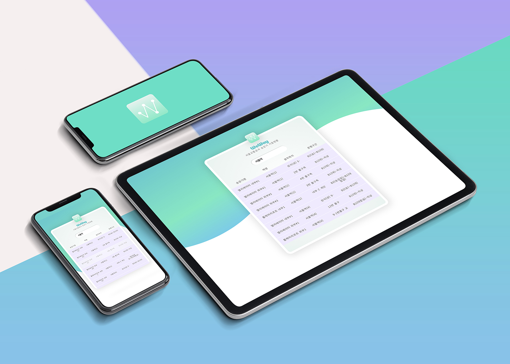

# WeWay

 

 

`WeWay`는 서울교통공사 각 역에 설치된 승강기의 가동현황 정보를 담은 애플리케이션입니다.
역명을 입력하면 승강기의 설치위치와 운행구간을 확인해볼 수 있습니다.

본 애플리케이션은 [서울 열린데이터 광장의 공공데이터](http://data.seoul.go.kr/dataList/OA-15994/S/1/datasetView.do)를 활용하여 만들어졌습니다.

모두가 자유롭고 안전한 이동권을 보장받길 바랍니다.
